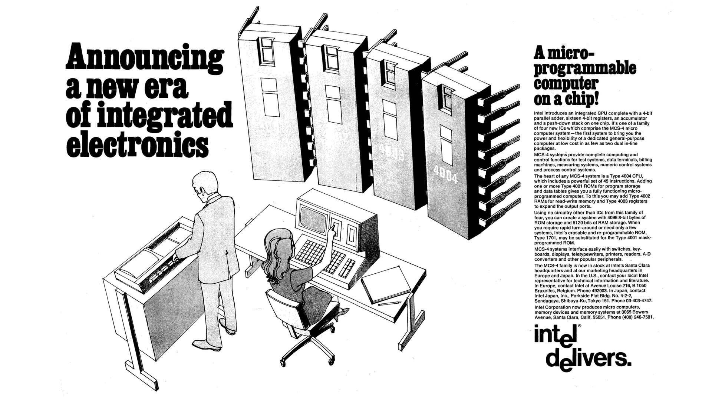
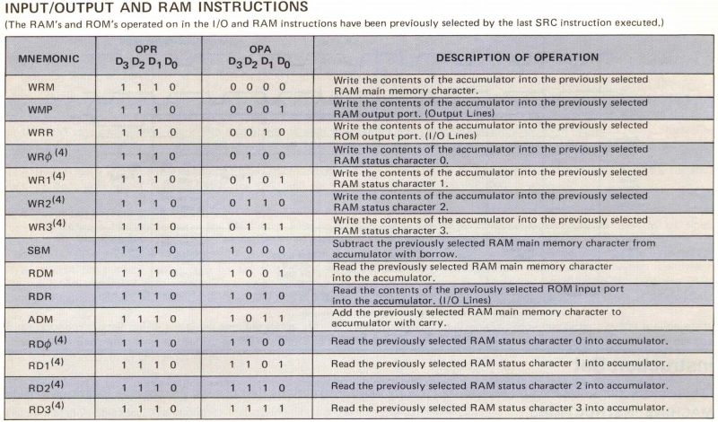
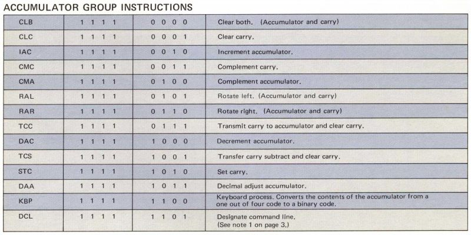
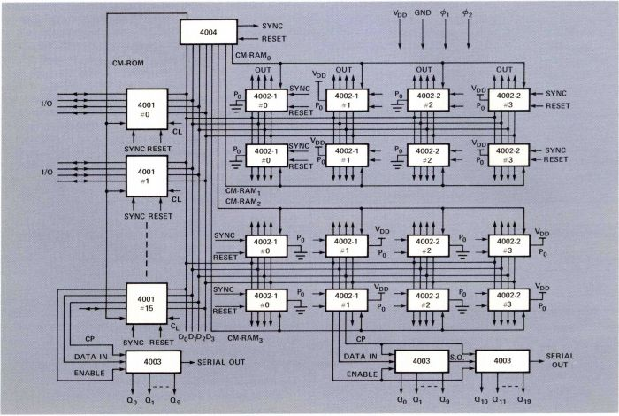

# T4000

This is a repository for a computing system based on Intel MCS-4 (in memory of Gordon Moore on 2023-03-24), comprising four 4000 series components, namely 4001 ROM, 4002 RAM, 4003 SR, and 4004 CPU. The instruction set in MCS-4 allows both binary and decimal arithmetic, including conditional branching, jump to subroutine, and indirect fetching. The manual can be found in [there](asset/Intel_MCS-4_Data_Sheet.pdf).

## Introduction

The MCS-4 system works on a 10.8 usec instruction cycle, basic instruction execution requires 8 or 16 cycles of a 750 KHz clock. In a typical sequence, the CPU sends 12 bits of address to the ROM's in the first three cycles (A1, A2.  A3). The selected ROM chip sends back 8 bits of instruction (OPR, OPA) to the CPU, in the next two cycles (M1, M2). The instruction is then interpreted and executed in the final three cycles (X1, X2, X3).

### 4001 ROM

The 4001 is a 2048-bit metal mask programmable ROM providing custom microprogramming capability for the MCS-4 micro computer set. It is organized as 256 x 8 bit words.

### 4002 RAM

The 4002 performs two functions. As a RAM it stores 320 bits arranged in 4 registers of twenty 4-bit characters each (16 main memory characters and 4 status characters). As a vehicle of communication with peripheral devices, it is provided with 4 output lines and associated control logic to perform output operations.

### 4003 SR

The 4003 is a 10-bit static shift register with serial-in, parallel-out and serial-out data. Its function is to increase the number of output lines to interface with I/O devices such as keyboards, displays, printers, teletypewriters, switches, readers, A-D converters, etc.

### 4004 CPU

The 4004 is a central processor unit (CPU) designed to work in conjunction with the other members of the MCS-4 (4001,4002,403) or microprogrammable computer applications.

### ISA

The MCS-4 has a very powerful Instruction Set that allows both binary and decimal arithmetic. It includes conditional branching, jump to subroutine and provides for the efficient use of ROM look up tables by indirect fetching. Typically, two 8 digit numbers can be added in 850 usec.

⚠️**Warning**: We transfer the address transmission operation of the FIN instruction to A2 and A3 period for the sake of design complexity reduction (it still spend 2 instruction cycles).

## System Architecture

## Reference

[Intel 4004](https://www.intel.com/content/www/us/en/newsroom/resources/intel-4004.html?wapkw=4004)
